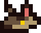

#  Crux Sit
"Crux Sit" é um jogo desenvolvido em C para a FPGA DE1-SoC com ajuda da GPU CoLenda, onde o jogador é um caçador de seres sobrenaturais e precisa impedir que ondas de monstros alcancem a vila.

O jogo apresenta três tipos de monstros: zumbis, lobisomens e vampiros. Cada tipo de monstro possui atributos únicos que influenciam sua movimentação e exigem diferentes tipos de munição para serem derrotados: bala normal para zumbis, bala de prata para lobisomens e dente de alho para vampiros.

Os zumbis movem-se lentamente, enquanto os lobisomens são rápidos e os vampiros exibem um movimento senoidal, desafiando a precisão do jogador. A mecânica do jogo é desenhada de forma a exigir habilidade e estratégia, pois cada monstro precisa ser abatido com a munição correta para evitar que alcancem a vila. O jogador possui três vidas, perdendo uma sempre que um monstro consegue atravessar a defesa. Os pontos são acumulados conforme os monstros são derrotados, e a rodada termina com o amanhecer.

A importância de escrever um driver para a GPU CoLenda reside na capacidade de explorar ao máximo o potencial da FPGA DE1-SoC, unindo o conhecimento adquirido sobre como o hardware influencia o software no produto final.

Os cenários e sprites dos monstros foram criados utilizando a plataforma online Piskel, que permite a exportação dos sprites como vetores de cores RGBA codificadas em hexadecimal. Para ler esses arrays e convertê-los em informações compatíveis com a biblioteca da GPU CoLenda, foi desenvolvida uma função específica. Esta função converte os números hexadecimais em seus valores correspondentes de RGBA (variando de 0 a 255 para vermelho, verde, azul e alfa, que indica a transparência do pixel). Além disso, foi implementada uma função de normalização para ajustar esses valores, dividindo cada componente da cor por 32 para que se encaixem em 3 bits cada (variando de 0 a 7).

Os monstros aparecem na tela movendo-se da direita para a esquerda, com o tipo de monstro (zumbi, lobisomem ou vampiro) sendo aleatorizado. As informações de cada monstro são então empacotadas em uma estrutura e armazenadas em um vetor, com suas posições livres sendo monitoradas por um vetor auxiliar, que registra se uma posição no vetor principal está ocupada por uma entidade ou não.

A movimentação dos monstros é gerida atribuindo posições e velocidades aleatórias a cada um e verificando o tempo decorrido entre as iterações. Utilizando fórmulas físicas de posição em relação à velocidade e ao tempo, assim como de velocidade em relação à aceleração e ao tempo, as posições de todos os monstros são atualizadas. A primeira fórmula é aplicada para atualizar as posições, enquanto a segunda é utilizada para calcular a velocidade atual dos lobisomens e vampiros.

Como mencionado anteriormente, os vampiros voam em senóides, e os lobisomens correm. Os lobisomens podem acelerar ou desacelerar aleatóriamente, mas o movimento do vampiro possui nuances a mais: isso é alcançado ao definir uma lógica para a velocidade e aceleração vertical do vampiro, utilizando um ponto fixo yo como referência para o eixo vertical.

- Primeiro, uma velocidade vertical aleatória (vy) é atribuída ao vampiro.
- A aceleração vertical do monstro (ay) é definida igual à sua velocidade vertical.
- Um ponto fixo yo é definido, e será usado como eixo de referência para o movimento senoidal.
- Se a posição vertical atual do monstro y for maior que yo e a aceleração vertical ay for positiva, inverte-se o sinal da aceleração para torná-la negativa.
- Se a posição vertical atual do monstro y for menor que yo e a aceleração vertical ay for negativa, inverte-se novamente o sinal da aceleração para torná-la positiva.

Essa lógica faz com que o monstro alterne sua direção vertical sempre que ultrapassa o ponto fixo yo, resultando em um movimento senoidal.

O jogo foi dividido em threads, a fim de tornar a verificação dos botões e movimentos do mouse em paralelo, consequentemente aumentando o desempenho.
