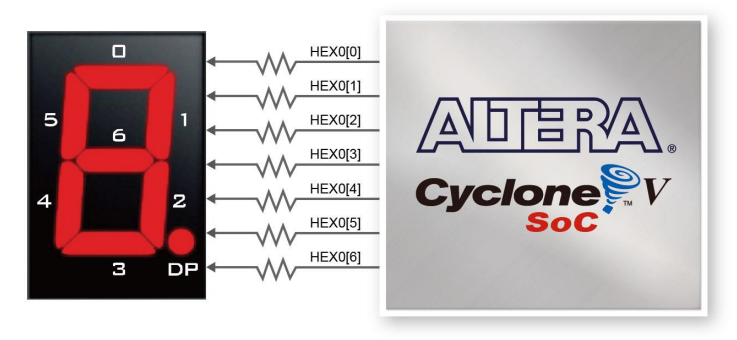

<div align="center" id="title">
  <p align="center">
    
  </p>

  <h1>
    "Crux Sit" - Jogo desenvolvido em C para o Kit de Desenvolvimento FPGA DE1-SoC
  </h1>
</div>

<div id="team">
<h2 align="justify"> Equipe </h2>

<uL>
  <li><a href="https://github.com/pierremachado">Pierre Machado</a></li>
  <li><a href="https://github.com/kevincorges">Kevin Borges</a></li>
  <li><a href="https://github.com/ZeDaManga01">José Alberto</a></li>
</ul>
</div>

<div id="resumo" align="justify"> 
<h3 align="center"> Resumo </h3>
Este README possui o objetivo de descrever a estruturação e a elaboração do jogo "Crux Sit", desenvolvido no Kit de Desenvolvimento DE1-SoC com o auxílio da arquitetura da GPU CoLenda, projeto relacionado ao Trabalho de Conclusão de Curso do discente Gabriel Barreto Alves. O projeto de desenvolvimento do jogo se baseou na preparação de um <i>driver</i> de núcleo <i>kernel</i> para implementar a comunicação com os barramentos da GPU CoLenda, além de bibliotecas auxiliares que processam a utilização do mouse, máquinas de estados, deslocamentos de bits e lógicas combinacionais, estruturando o alicerce do código do jogo. A implementação do jogo atendeu a todos os requisitos necessários e propõem um projeto de jogo operante e funcional.
</div>

<div id="abstract" align="justify"> 
<h3 align="center"> Abstract </h3>
This README aims to describe the structuring and development of the game “Crux Sit”, developed in the DE1-SoC Development Kit with the help of the CoLenda GPU architecture, the Final Project of the student Gabriel Barreto Alves. The game development project was based on preparing a kernel driver to implement communication with the CoLenda GPU buses, as well as auxiliary libraries that process the use of the mouse, state machines, bit shifts and combinational logic, structuring the foundation of the game code. The implementation of the game met all the necessary requirements and proposes an operative and functional project.
</div>

<div id="intro" align="justify">
<h2> 1. Introdução </h2>

A importância de desenvolver um driver para a GPU CoLenda reside na capacidade de explorar ao máximo o potencial da FPGA DE1-SoC, unindo o conhecimento adquirido sobre como o hardware influencia o software no produto final. Desse modo, foi designado aos discentes de Sistemas Digitais do curso de Engenharia de Computação da Universidade Estadual de Feira de Santana (UEFS) o desenvolvimento de um jogo a ser executado no Kit de Desenvolvimento FPGA DE1-SoC. Mais detalhes acerca do problema podem ser encontrados [<u>neste documento</u>](docs/pdf/descricao_problema3.pdf).

No contexto deste projeto, o jogo desenvolvido em C para a FPGA DE1-SoC e com o auxílio da GPU CoLenda foi "Crux Sit", onde o jogador assume o papel de um caçador de seres sobrenaturais e precisa impedir que ondas de monstros alcancem a vila. O jogo apresenta três tipos de monstros: zumbis, lobisomens e vampiros. Cada tipo de monstro possui atributos únicos que influenciam sua movimentação e exigem diferentes tipos de munição para serem derrotados: bala normal para zumbis, bala de prata para lobisomens e dente de alho para vampiros.

Os zumbis movem-se lentamente, enquanto os lobisomens são rápidos e os vampiros exibem um movimento senoidal, desafiando a precisão do jogador. A mecânica do jogo é desenhada de forma a exigir habilidade e estratégia, pois cada monstro precisa ser abatido com a munição correta para evitar que alcancem a vila. O jogador possui cinco vidas, perdendo uma sempre que um monstro consegue atravessar a defesa. Os pontos são acumulados conforme os monstros são derrotados, e a partida termina com o amanhecer.

</div>


<div id="metodo" align="justify"> 
<h2> 2. Metodologia </h2>

  Esta seção visa expor o processo de criação do jogo "Crux Sit" e a sua implementação no Kit de Desenvolvimento DE1-SoC.

  <div id="req">
  <h3 align="justify"> 2.1. Requisitos </h3>

  A fim de implementar o jogo "Crux Sit" no Kit de Desenvolvimento DE1-SoC, algumas restrições devem ser atendidas:

  - O código deve ser escrito em linguagem C, e só poderá utilizar os componentes disponíveis na placa;
  - O fluxo do jogo deve permitir ser controlado pelos botões presentes no Kit DE1-SoC. No mínimo, a pausa, retorno, reinício e término do jogo devem ser implementados, permitindo realizar quaisquer destas ações a qualquer momento do jogo;
  - Pelo menos um sprite deve ser implementado na memória de sprites da GPU CoLenda;
  - Em relação à jogabilidade, informações do jogo devem ser exibidas no display de 7-segmentos, indicando ao jogador, por exemplo, a quantidade de vidas disponíveis ou placar. As ações do ator do jogo devem ser comandados pelo mouse, cuja velocidade deve refletir na movimentação do elemento na tela relacionado ao jogador. Por fim, pelo menos um elemento passivo ou entidade no jogo devem se mover.

  </div>

  <div id="sft_ut" align="justify"> 
  <h3> 2.2. Softwares Utilizados</h3>

  #### 2.2.1. C

  A linguagem de programação C é amplamente utilizada em projetos devido à sua eficiência e versatilidade. Com sua sintaxe direta e controle próximo sobre o hardware, o C permite desenvolver programas robustos e rápidos, especialmente em sistemas embarcados, drivers de dispositivos e software de baixo nível. No contexto deste projeto, a utilização da linguagem C foi um dos requisitos necessarios a serem cumpridos.

  #### 2.2.2. Visual Studio Code

  O Visual Studio Code é uma ferramenta popular e altamente funcional utilizada em uma variedade de projetos de desenvolvimento de software. O uso dele foi necessário para agilizar o desenvolvimento, permitindo editar, depurar e gerenciar o código de maneira simplificada e eficaz.

  #### 2.2.3. GNU/Linux

  Por fim, o kit de desenvolvimento DE1-SoC possui uma distribuição do Linux embarcado instalada, possibilitando a comunicação com o kit bem como a execução dos códigos criados através de conexão remota. Isso oferece uma gama de possibilidades para a elaboração do problema: a disposição dos diretórios do sistema e a possibilidade de compilar códigos na linguagem de programação requisitada de forma fácil com o compilador GCC embarcado no kit de desenvolvimento foram fundamentais.

  </div>


  <div id="kit_placa" div align="justify"> 
  <h3> 2.3. Kit de Desenvolvimento DE1-SoC</h3>

  O Kit de Desenvolvimento DE1-SoC apresenta uma plataforma robusta de design de *hardware* construída em torno do *Altera FPGA System-on-Chip* (SoC), que combina os mais recentes núcleos incorporados Cortex-A9 *dual-core* com lógica programável líder do setor para máxima flexibilidade de projeto.

  <div align="center">
  <figure>
    
    <br>
    <figcaption> Figura 1: Kit de Desenvolvimento FPGA DE1-SoC. </figcaption>
  </figure>
  </div>
  <br>

  #### 2.3.1. ARM CORTEX A9

  A arquitetura utilizada por esse processador é a RISC – Reduced Instruction Set Computer. Sua operações lógicas e aritméticas são efetuadas em operadores dos registradores de propósito geral. Os dados são movidos entre a memória e esses registradores por meio de instruções de carga e armazenamento - Load and Store.

  #### 2.3.2. Registradores

  O ARM possui 16 registradores de 32 bits, sendo 15 de uso geral, R0 a R14 e um Program Counter R15. O registrador R15 tem o endereço da próxima instrução que será executada. Os registradores R13 e R14, são usados convencionalmente como ponteiro de pilha Stack Pointer, que contém o endereço atual do elemento superior da pilha e registrador de link Link Register, que recebe o endereço de retorno em chamadas de procedimento, respectivamente.

  #### 2.3.3. Memória

  A placa suporta 1GB de SDRAM DDR3, compreendendo dois dispositivos DDR3 de 16 bits cada no lado do HPS. Os sinais estão conectados ao Controlador de Memória Dedicado para os bancos de I/O do HPS e a velocidade alvo é de 400 MHz.

  #### 2.3.4. Gigabit Ethernet
  
  A placa suporta transferência Gigabit Ethernet por um chip externo Micrel KSZ9021RN PHY e função HPS Ethernet MAC. O chip KSZ9021RN com Gigabit 10/100/1000 Mbps integrado. O transceptor Ethernet também suporta interface RGMII MAC.

  #### 2.3.5. Diagrama de Blocos da DE1-SoC

  Todas as conexões são estabelecidas através do dispositivo Cyclone V SoC FPGA para fornecer flexibilidade máxima aos usuários. Os usuários podem configurar o FPGA para implementar qualquer projeto de sistema.

  <div align="center">
  <figure>
    
    <br>
    <figcaption> Figura 2: Diagrama do Kit de Desenvolvimento DE1-SoC. </figcaption>
  </figure>
  </div>
  <br>

  </div>


  <div id="sft_ut" align="justify"> 
  <h3> 2.4. Componentes Utilizados</h3>

  #### 2.4.1. GPU CoLenda

  Unidade de processamento gráfico, também conhecida como GPU, é um componente eletrônico projetado para acelerar tarefas relacionadas à computação gráfica e ao processamento de imagens em uma ampla gama de dispositivos, incluindo placas de vídeo, placas-mãe, smartphones e computadores pessoais (PCs). A capacidade da GPU de realizar cálculos matemáticos complexos de forma rápida e eficiente reduz significativamente o tempo necessário para que um computador execute uma variedade de programas.

  O discente Gabriel Barreto Alves foi responsável pelo projeto de elaboração da CoLenda, GPU utilizada no projeto. A CoLenda é capaz de renderizar, em uma tela de resolução 640x480, dois tipos de polígonos convexos (quadrado e triângulo), <i>sprites</i>, planos de fundo e blocos de *pixel* 8x8, possibilitando a seleção de cor com 3 bits para vermelho, verde e azul para os dois últimos e para os *pixels* dos sprites. Há a possibilidade de utilizar quatro tipos de instruções diferentes.

  A Figura 1 exemplifica a arquitetura da GPU CoLenda, destacando as principais entradas e saídas de dados.

  <div align="center">
  <figure>
    
    <br>
    <figcaption> Figura 3: Arquitetura da GPU CoLenda. </figcaption>
  </figure>
  </div>
  <br>

  Na figura acima, os dados são transportados do processador NIOS II pelos barramentos data A e data B, respectivamente. Eles são armazenados em suas respectivas filas, e a execução é pausada retirando os elementos das filas simultaneamente. O processador gráfico então executa as instruções com base na ordem que as filas se dispõem. Se uma das duas filas estiver cheia, um sinal em nível lógico alto é enviado ao barramento wrfull, sendo capturado posteriormente pelo sistema.

  As instruções que cada barramento pode receber estão exemplificadas nas figuras abaixo. Toda instrução possui um opcode para ser decodificada pelo processador gráfico no barramento data A, e as configurações da instrução são passadas pelo barramento data B.

  As figuras 4 e 5 são referentes à instrução de escrita no banco de registradores, responsável por definir um sprite na tela e por alterar a cor do plano de fundo, respectivamente. Seu opcode é 0000.

  <div align="center">
  <figure>
    
    <br>
    <figcaption> Figura 4: Instrução WBR para definir um sprite. </figcaption>
  </figure>
  </div>
  <br>

  <div align="center">
  <figure>
    
    <br>
    <figcaption> Figura 5: Instrução WBR para definir o plano de fundo. </figcaption>
  </figure>
  </div>
  <br>

  A figura 6 exemplifica os blocos de plano de fundo utilizados na função WBM, com opcode 0010. Cada um pode ser alterado individualmente, utilizando uma sintaxe similar à instrução WBR.

  <div align="center">
  <figure>
    
    <br>
    <figcaption> Figura 6: Instrução WBM para definir um bloco na memória de background. </figcaption>
  </figure>
  </div>
  <br>

  A figura 7 exemplifica a instrução WSM, com opcode 00001, responsável por definir um pixel na memória de sprites. É a instrução que torna possível definir sprites personalizados para o jogo.

  <div align="center">
  <figure>
     
    <br>
    <figcaption> Figura 7: Instrução WSM para definir um pixel na memória de sprites. </figcaption>
  </figure>
  </div>
  <br>

  Por fim, a Figura 8 e a Tabela 1 demonstram a instrução DP, com opcode 0011, para definir um dos polígonos convexos na tela. O tipo de polígono convexo é definido por um bit (0 = quadrado, 1 = triângulo), e o tamanho é definido por números de 0 a 15.

<div align="center">
  <figure>
     
    <br>
    <figcaption> Figura 8: Instrução DP para definir um polígono na tela. </figcaption>
  </figure>
  </div>
  <br>

<div align="center">
  <figure>
     
    <br>
    <figcaption> Tabela 1: Tamanhos de polígono. </figcaption>
  </figure>
  </div>
  <br>

  #### 2.4.2. Monitor CRT

  O monitor utilizado no projeto foi o DELL M782p, um modelo CRT. Esse tipo de monitor utiliza um tubo de raios catódicos (CRT) para exibir imagens. O DELL M782p possui uma tela de visualização de 17 polegadas e uma resolução máxima de 1280x1024 *pixels*. Ele oferece uma interface VGA para conexão com o computador ou placa de desenvolvimento. Os monitores CRT são conhecidos por sua reprodução de cores vibrantes e tempos de resposta rápidos, tornando-os uma escolha adequada para projetos que exigem interação em tempo real, como jogos e simulações.

  <div align="center">
  <figure>
     
    <br>
    <figcaption> Figura 9: Imagem renderizada pela CoLenda no DELL M782p. </figcaption>
  </figure>
  </div>
  <br>

  #### 2.4.3. Display de 7 segmentos

  A placa DE1-SoC possui seis displays de 7 segmentos. Esses displays são emparelhados para exibir números em vários tamanhos. A figura 11 mostra a conexão dos sete segmentos (anodo comum) aos pinos do FPGA Cyclone V SoC. O segmento pode ser ligado ou desligado aplicando um nível lógico baixo ou alto, respectivamente, do FPGA. Cada segmento em um display é indexado de 0 a 6.

  <div align="center">
  <figure>
     
    <br>
    <figcaption> Figura 10: Conexões do display de 7 segmentos. </figcaption>
  </figure>
  </div>
  <br>

  #### 2.4.4. Push-buttons

  A placa possui quatro botões conectados ao FPGA, conforme ilustrado na Figura 12, que mostra as conexões entre os botões e o FPGA Cyclone V SoC. Os quatro botões, denominados KEY0, KEY1, KEY2 e KEY3, recebem um debounce e são conectados diretamente ao FPGA Cyclone V SoC. Quando pressionado, o botão gera um nível lógico baixo, e quando não pressionado, um nível lógico alto.

  <div align="center">
  <figure>
     
    <br>
    <figcaption> Figura 11: Diagrama dos botões presentes na FPGA. </figcaption>
  </figure>
  </div>
  <br>


  </div>

  <div id="development" align="justify"> 
  <h2> 3. Desenvolvimento </h2>

  Esta seção está destinada a discorrer acerca do desenvolvimento do projeto e a sequência de passos do seu planejamento.

  </div>

  <div id="driver" align="justify"> 
  <h3> 3.1. Driver de módulo kernel</h3>

  Foi desenvolvido um driver de módulo <i>kernel</i> a fim de gerenciar estas instruções com o uso de uma biblioteca, cuja metodologia de desenvolvimento pode ser acessada através [<u>deste link</u>](https://github.com/ZeDaManga01/PBL-02-MI---Sistemas-Digitais). Isso se deve à substituição do NIOS II pelo processador ARM presente no Kit DE1-SoC, onde foi necessário implementar um novo meio de comunicação entre o processador e os barramentos. A biblioteca desenvolvida dispõe de seis funções, projetadas com tratamento dos dados recebidos e deslocamento de bits, a fim de ser gerenciado pelo driver de módulo kernel.

  Abaixo, há as declarações das funções disponíveis na biblioteca. A sua implementação foi de suma importância, uma vez que facilitou o processo de renderizar as imagens do jogo na tela. 

  ```c
  #define DRIVER_NAME "/dev/colenda_driver" // Caminho do arquivo nó do driver

  #define WBR 0b0000 // Escrita no Banco de Registradores
  #define WSM 0b0001 // Escrita na Memória de Sprites
  #define WBM 0b0010 // Escrita na Memória de Background
  #define DP 0b0011 // Definição de Polígono

  int setbackground(FILE *gpu, uint8_t red, uint8_t green, uint8_t blue);
  int setsprite(FILE *gpu, uint8_t layer, int show, uint16_t x, uint16_t y, uint16_t sprite);
  int setspritememory(FILE *gpu, uint_fast16_t address, uint_fast8_t red, uint_fast8_t green, uint_fast8_t blue);
  int setspritememorywithreg(FILE *gpu, uint8_t reg, uint16_t pixel, uint_fast8_t red, uint_fast8_t green, uint_fast8_t blue);
  int setpoligon(FILE *gpu, uint_fast8_t layer, uint_fast8_t type, uint16_t x, uint16_t y, uint_fast8_t red, uint_fast8_t green, uint_fast8_t blue, uint_fast8_t size);
  int setbackgroundblock(FILE *gpu, uint_fast8_t row, uint_fast8_t column, uint_fast8_t red, uint_fast8_t green, uint_fast8_t blue);
  ```

  </div>

  <div id="sprite" align="justify"> 
  <h3> 3.2. Criação dos cenários e sprites </h3>

  Os cenários e sprites dos monstros foram criados utilizando a plataforma online Piskel, que permite a exportação dos sprites como vetores de cores RGBA codificadas em hexadecimal. 

  <div align="center">
  <figure>
    
    <br>
    <figcaption>Figura 12: Sprite do zumbi.</figcaption>
  </figure>
  </div>
  <br>

  <div align="center">
  <figure>
    
    <br>
    <figcaption>Figura 13: Sprite do lobisomem.</figcaption>
  </figure>
  </div>
  <br>

  <div align="center">
  <figure>
    
    <br>
    <figcaption>Figura 14: Sprite do vampiro.</figcaption>
  </figure>
  </div>
  <br>

  Para ler esses arrays e convertê-los em informações compatíveis com a biblioteca da GPU CoLenda, foi desenvolvida uma biblioteca específica. Nomeada de <i>hexdecode</i>, esta biblioteca converte os números hexadecimais em seus valores correspondentes de RGBA (variando de 0 a 255 para vermelho, verde, azul e alfa, que indica a transparência do pixel). Além disso, há uma função de normalização para ajustar esses valores, dividindo cada componente da cor por 32 para que se encaixem em 3 bits cada (variando de 0 a 7).

  ```c
  typedef struct {
      unsigned int r; // Vermelho
      unsigned int g; // Verde
      unsigned int b; // Azul
      unsigned int a; // Transparência
  } rgba_t;

  rgba_t hextorgba(unsigned int hex); // Função de conversão dos valores através de deslocamento de bits
  rgba_t normalizergba(rgba_t color); // Função de normalização dos valores
  ```

  </div>

  <div id="code" align="justify"> 
  <h3> 3.3. Captura de eventos do mouse </h3>

  Neste problema, a captura de eventos do mouse também se mostrou extremamente importante, dado que uma das restrições era a combinação das ações do mouse para o ator do jogo. No contexto deste projeto, a biblioteca de captura de eventos do mouse, desenvolvida nos [<u>problemas anteriores</u>](https://github.com/ZeDaManga01/PBL-01-MI---Sistemas-Digitais), foi reutilizada.

  Entretanto, algumas melhorias foram feitas para tornar a biblioteca mais robusta e responsível. A título de exemplo, a principal alteração para a biblioteca foi a implementação de uma pseudomáquina de estados de Mealy, demonstrada pela figura 16. Essa máquina de estados, implementada a nível de software, registra apenas um único nível lógico alto de clique ou de liberação do botão do mouse, ao invés de registrar vários níveis lógicos altos.

  <div align="center">
  <figure>
    
    <br>
    <figcaption>Figura 15: Diagrama da máquina de Mealy (FSM) do mouse.</figcaption>
  </figure>
  </div>

  </div>

  <div id="mov" align="justify"> 
  <h3> 3.4. Movimentação </h3>

  Os monstros aparecem na tela movendo-se da direita para a esquerda, com o tipo de monstro (zumbi, lobisomem ou vampiro) sendo aleatorizado. As informações de cada monstro são então empacotadas em uma estrutura e armazenadas em um vetor, com suas posições livres sendo monitoradas por um vetor auxiliar, que registra se uma posição no vetor principal está ocupada por uma entidade ou não.

  A movimentação dos monstros é gerida atribuindo posições e velocidades aleatórias a cada um e verificando o tempo decorrido entre as iterações. Utilizando fórmulas físicas de posição em relação à velocidade e ao tempo, assim como de velocidade em relação à aceleração e ao tempo, as posições de todos os monstros são atualizadas. A primeira fórmula é aplicada para atualizar as posições, enquanto a segunda é utilizada para calcular a velocidade atual dos lobisomens e vampiros.

  Como mencionado anteriormente, os vampiros voam em senóides, e os lobisomens correm. Os lobisomens podem acelerar ou desacelerar aleatóriamente, mas o movimento do vampiro possui nuances a mais: isso é alcançado ao definir uma lógica para a velocidade e aceleração vertical do vampiro, utilizando um ponto fixo yo como referência para o eixo vertical.

  - Primeiro, uma velocidade vertical aleatória (vy) é atribuída ao vampiro.
  - A aceleração vertical do monstro (ay) é definida igual à sua velocidade vertical.
  - Um ponto fixo yo é definido, e será usado como eixo de referência para o movimento senoidal.
  - Se a posição vertical atual do monstro y for maior que yo e a aceleração vertical ay for positiva, inverte-se o sinal da aceleração para torná-la negativa.
  - Se a posição vertical atual do monstro y for menor que yo e a aceleração vertical ay for negativa, inverte-se novamente o sinal da aceleração para torná-la positiva.
  
  <div align="center">
  <figure> 
    
    <br>
    <figcaption>Figura 16: Diagrama da movimentação do vampiro.</figcaption> 
  </figure>
  </div>

  Essa lógica faz com que o monstro alterne sua direção vertical sempre que ultrapassa o ponto fixo yo, resultando em um movimento senoidal.

  A movimentação do mouse na tela foi possível através da declaração de uma estrutura para o cursor, que armazena a posição atual, e uma função que calcula a nova posição do cursor de acordo com o deslocamento do mouse. O código dispõe de uma função, da biblioteca da GPU CoLenda, de renderizar um sprite cuja posição é relativa ao cursor do mouse. Por fim, também dispõe de uma função para prender o cursor na tela, impossibilitando que a posição do cursor ultrapasse as limitações da tela. Essa mesma função também é utilizada para manter o vampiro dentro dos limites da tela, pois seria possível do vampiro sair dos limites da tela em caso contrário, dificultando a mira do jogador.

  </div>

  <div id="fpga" align="justify">
  <h3> 3.5. Componentes da FPGA </h3>

  As informações dos componentes da FPGA utilizados (push-buttons e display de 7 segmentos) foram armazenados em uma estrutura, descrita na biblioteca <i>fpga</i>, e podem ser controlados por meio do mapeamento de memória. A estrutura armazena os ponteiros para os endereços de memória desses componentes, e é possível controlá-los atribuindo informações para o conteúdo desses ponteiros.

  ```c
  typedef struct fpga_map_arm_t {
    int fd;
    void *mapped_ptr;

    volatile int *KEY_ptr;

    volatile int *HEX5_ptr;
    volatile int *HEX4_ptr;
    volatile int *HEX3_ptr;
    volatile int *HEX2_ptr;
    volatile int *HEX1_ptr;
    volatile int *HEX0_ptr;
  } fpga_map_arm_t;

  int fpgainit(fpga_map_arm_t *fpga_map);
  int fpgaclose(fpga_map_arm_t *fpga_map);
  ```

  <div id="keys" align="justify">
  <h4> 3.5.1. Botões </h3>

  Os botões, assim como o mouse, possuem uma pseudomáquina de estados implementada no código do jogo, para que o nível lógico alto seja capturado em apenas uma iteração do laço de execução do jogo. Eles são responsáveis por controlar o fluxo do jogo, sendo atribuídos com a pausa, retorno e saída da seguinte maneira:
  
  - O KEY 0 é responsável por iniciar o jogo e retornar ao menu principal;
  - O KEY 1 é responsável por pausar o jogo;
  - O KEY 2 é responsável por encerrar a execução do jogo.
  
  Abaixo, há o protótipo da função de ler as informações dos botões.

  ```c
  void readkeys(fpga_map_arm_t fpga_map, int *pressed_keys, size_t size); // Função que lê os estados dos botões e os coloca no vetor pressed_keys
  ```

  </div>

  <div id="svnsg" align="justify">
  <h3> 3.5.2. Display de 7 segmentos </h3>

  Para o display de 7 segmentos, foi atribuída a responsabilidade de mostrar a pontuação atual do jogador. Foi necessário implementar a lógica de ativação dos dígitos por meio de uma tabela verdade, exemplificada na Tabela 2.

  <div align="center">
  <figure> 
    
    <br>
    <figcaption>Tabela 2: Tabela verdade do <i>display</i> de 7 segmentos.</figcaption> 
  </figure>
  </div>
  <br>

  Antes do conteúdo ser atribuído ao dígito correspondente, todos os bits das saídas recebidas pela FPGA são invertidos, porque, como exemplificado na subseção 2.4.3, o display de 7 segmentos presente na DE1-SoC é do tipo ânodo comum. As funções abaixos são responsáveis por realizar a manipulação correta desses dados.

  ```c
  int numbertodigit (int number); // Função que converte um número de 0 a 9 em suas saídas correspondentes do display de 7 segmentos
  void setdigit(fpga_map_arm_t fpga_map, int number, int hex); // Função que envia o número para o digito escolhido (hex) com a saída invertida da função numbertodigit
  ```
  </div>
  </div>


  <div id="code" align="justify"> 
  <h3> 3.6. Dinâmica do jogo </h3>

  Assim que o jogo é iniciado, entidades com atributos aleatórios são geradas em um intervalo de tempo fixo. A cada iteração do laço de repetição do jogo, a posição de todas as entidades é atualizada, percorrendo o vetor principal que armazena as suas informações e o vetor auxiliar de valores booleanos que indicam se há uma entidade nessa posição ou não.

  Há 20 (vinte) espaços no vetor de entidades. Quando uma entidade é gerada, ela é colocada no primeiro espaço disponível do vetor principal. Um laço de repetição percorre o vetor auxiliar procurando por um espaço disponível, e se não o encontrar, significa que todos os espaços estão preenchidos (*i.e.*, há vinte entidades na tela), e nenhuma nova entidade é gerada.

  Quando um clique do botão esquerdo do mouse é capturado, o código pausa e começa a percorrer todo o vetor de entidades. Se a posição atual do cursor colidir com a posição de uma entidade na tela, a entidade é removida, o jogador ganha a quantidade de pontos referente à entidade abatida: 100 (cem) pontos para zumbi, 300 (trezentos) pontos para lobisomem e 500 (quinhentos) pontos para o vampiro, e há um retorno visual. Em caso contrário, o jogo continua com o fluxo normal. Uma entidade também é removida quando ela ultrapassa o limite horizontal da tela, e o jogador perde uma vida. Caso o jogador perca todas as 5 (cinco) vidas, o jogo mostra uma tela de derrota e volta ao menu principal. Caso o jogador consiga abater 40 (quarenta) entidades, uma tela indicando a sua vitória é mostrada e o jogo também retorna ao menu principal. Uma função que testa a colisão entre duas entidades foi implementada, e, mesmo que as entidades tenham tamanho 20x20 pixels, elas possuem *hitboxes* um pouco maiores de tamanho 30x30, enquanto a *hitbox* do mouse é de tamanho 20x20.

  ```c
  int checkcollision(int x1, int y1, int x2, int y2, int size_x1, int size_y1, int size_x2, int size_y2); // Função que testa a colisão entre duas entidades.
  ```

  Quando o clique direito do mouse é capturado, o jogador troca de munição, alternando entre três tipos de munição diferentes. O tipo de munição selecionado deve corresponder ao tipo da entidade a ser abatida, senão, ela permanece na tela até ser eliminada, seja pelo jogador ou pelo próprio jogo. A Figura 17 apresenta o fluxograma do funcionamento do código.

  <div align="center">
  <figure> 
    
    <br>
    <figcaption>Figura 17: Fluxograma do jogo.</figcaption> 
  </figure>
  </div>
  <br>

  O fluxo do jogo pode ser alterado ou interrompido a qualquer momento com o uso dos botões. Nesse caso, não é considerado nem vitória e nem derrota do jogador.

  Com o auxílio da biblioteca *pthreads,* o jogo foi dividido em *threads*, a fim de tornar a verificação dos botões e movimentos do mouse em paralelo, consequentemente aumentando o desempenho. A <i>thread</i> principal do jogo é responsável por renderizar a tela e atualizar a posição e velocidade das entidades do jogo, enquanto a *thread* do mouse é responsável por capturar os eventos do mouse e a *thread* dos botões, de forma análoga, é responsável por capturar os eventos dos *push-buttons* da FPGA.

  É importante salientar que, para que os botões tenham prioridade sobre o controle das outras duas *threads* do jogo, as outras duas *threads* possuem mecanismos de pausa. São úteis também quando a *thread* do mouse deseja percorrer o vetor de entidades para identificar a entidade a ser abatida. Assim, a *thread* do jogo é pausada para evitar possíveis condições de corrida. 

  </div>

  <div id="test" align="justify"> 
  <h3> 3.7. Testes</h3>
  </div>

  A figura 18 demonstra um "teste de estresse" para a GPU CoLenda, sendo uma etapa crucial para conferir a possibilidade de animações das entidades na tela. Foi implementada a movimentação de um elemento passivo na tela, enquanto a posição de 20 (vinte) elementos era atualizada a cada iteração do lado de repetição. A GPU CoLenda mostrou não ter engasgos ao renderizar várias entidades trocando de posição simultaneamente.

  <div align="center">
  <figure> 
    
    <br>
    <figcaption>Figura 18: Teste de estresse da GPU CoLenda.</figcaption> 
  </figure>
  </div>
  <br>

  A figura 19 apresenta os testes feitos para a movimentação dos elementos na tela, assim como um rascunho para o plano de fundo utilizado no jogo com o auxílio da biblioteca *hexdecode*.

  <div align="center">
  <figure> 
    
    <br>
    <figcaption>Figura 19: Teste de background e da movimentação das entidades do jogo.</figcaption> 
  </figure>
  </div>
  <br>
  
</div>

<div id="result" align="justify"> 
<h2> 4. Resultados e discussões</h2>
</div>

As figuras abaixo estão reservadas para a demonstração dos resultados obtidos do jogo.

<div align="center">
<figure>
  
  <br>
  <figcaption>Figura 20: Menu principal e jogabilidade</figcaption>
</figure>
</div>

<div align="center">
<figure>
  
  <br>
  <figcaption>Figura 21: Tela de vitória do jogo</figcaption>
</figure>
</div>

<div align="center">
<figure>
  
  <br>
  <figcaption>Figura 22: Tela de derrota do jogo</figcaption>
</figure>
</div>

<div align="center">
<figure>
  
  <br>
  <figcaption>Figura 23: Display de 7 segmentos contabilizando os pontos</figcaption>
</figure>
</div>

<div id="resultconcl" align="justify"> 
<h2> 5. Conclusão</h2>

Conclui-se que o projeto foi implementado de forma satisfatória, atendendo com êxito a todos os requisitos impostos na subseção 2.1. O driver reutilizado dos problemas anteriores se mostrou funcional, renderizando os elementos na tela sem perdas de performance significativas. Além disso, as bibliotecas desenvolvidas e melhoradas para o código e para controlar os elementos da FPGA são funcionais, e a implementação de *threads* foi essencial para garantir que o desempenho do jogo não fosse afetado da mesma forma que seria se implementado em série.

Este projeto foi essencial para expandir o conhecimento acerca do Kit de Desenvolvimento, GNU/Linux embarcado e a comunicação hardware/software, e espera-se que o estudo das bibliotecas e os testes realizados contribuam para a eficiência e sofisticação de projetos futuros envolvendo o Kit de Desenvolvimento DE1-SoC e a GPU CoLenda.
</div>


<div id="makefile"> 
<h2> Instruções para executar o programa</h2>
<div align="justify">

<h3> 1. Instalação do driver </h3>

Abrindo a pasta do projeto no terminal, escreva:

```
cd driver
sudo make install
```

Siga as instruções mostradas no fim da instalação do driver para a criação do arquivo nó.

<h3> 2. Execução do jogo </h3>

Volte para o diretório do projeto e escreva:

```
cd game
sudo make
sudo ./main
```

<h3> 3. Limpeza dos arquivos do jogo </h3>

```
make clean
```

<h3> 4. Desinstalação do driver </h3>
Para desinstalar o driver, com o diretório do projeto aberto no terminal, escreva:

```
cd driver
sudo make uninstall
```

O driver será automaticamente desalocado da memória e o arquivo nó será deletado, se existir.

<div id="ref"> 
<h2> Referências </h2>
<div align="justify">
  
DE1-SoC Board. Disponível em: https://www.terasic.com.tw/cgi-bin/page/archive.pl?Language=English&No=836&PartNo=4. Acessado em: 7 de maio de 2024.

Introduction to the ARM Cortex-A9 Processor. Disponível em: https://github.com/fpgacademy/Tutorials/releases/download/v21.1/ARM_intro_intelfpga.pdf. Acessado em: 5 de maio de 2024.
</div>
